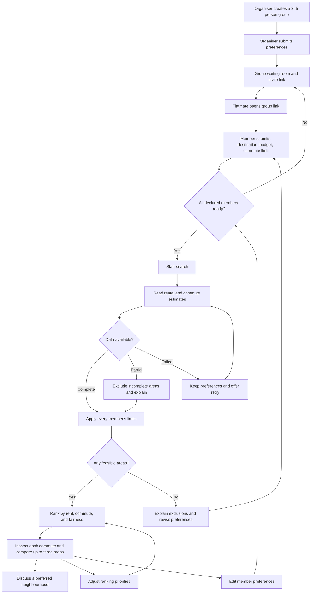

# FlatSplit user journey and responsive wireframes

**Issue:** [#1 — Map user journey and responsive wireframes](https://github.com/horiiiiii032929/CS5225-teams12-2026/issues/1)  
**Draft:** 9 October 2026, Singapore time  
**Owner:** Hikaru · **Reviewer:** @Raccoon33 · **Status:** Ready for team review; scope decisions below are proposed, not approved.

FlatSplit helps 2–5 flatmates find Singapore rental areas that respect every member’s budget and public-transport commute limit. The key design principle is that a good group average must never hide an unacceptable outcome for one person.

This deliverable combines a working React wireframe with the journey, screen behaviour, decisions, and a review script. All rents and routes are fictional fixtures. Processing is simulated in the browser. Nothing here establishes real rental availability, validates a route, shares a live group, or measures cloud performance.

## Open the prototype

From the repository root, run `pnpm dev:web` and open **http://127.0.0.1:5173/**. The API is optional. Install dependencies first with `pnpm install --frozen-lockfile` on a fresh checkout.

Use the **Design review** selector to load each scenario. Choosing a scenario replaces the current draft with a fixture. **Restart journey** clears the current draft. Refresh also resets the page to its URL’s fixture; inputs are held in memory only. Use sample personal information.

| Preview         | URL                    | What to review                                             |
| --------------- | ---------------------- | ---------------------------------------------------------- |
| Create group    | `/?review=create`      | Group name, creator name, 2–5 members                      |
| Waiting room    | `/?review=group`       | Two of three ready; search disabled                        |
| Invitee entry   | `/?review=join`        | Sam’s unsubmitted preferences                              |
| Member input    | `/?review=preferences` | Destination, budget, maximum commute, validation           |
| Processing      | `/?review=processing`  | Paused progress preview; complete with the demo control    |
| Results         | `/?review=results`     | Five feasible areas, priority switching, comparison        |
| No matches      | `/?review=empty`       | Everyone has a 10-minute limit; explicit exclusion reasons |
| Partial data    | `/?review=partial`     | Missing Queenstown route; exclusion and retry              |
| Service failure | `/?review=failure`     | Retained preferences, retry, return to group               |

These are local preview links. An invite preview always opens the sample group; it does not encode or transmit a custom group, grant membership, or synchronise devices.

## Product boundaries

The baseline comes from **Preliminary.docx**, sections 3, 4.1, 5.2, and 6.3, and issue #1. Keep the original supplied document unchanged.

- Singapore town-level suggestions, with one destination per member and public-transport travel estimates.
- Historical whole-flat rent estimates, divided equally among the declared group size; utilities excluded.
- No property listings, availability guarantees, booking, payments, subscriptions, or login in this prototype.
- Everyone’s limits are hard constraints. Priority controls change ordering only after feasibility checks.
- The browser uses six sample areas and five fixed destinations. Live geocoding, verified HDB data, external transport calls, and AWS jobs belong to later implementation work.

The preliminary report mentions optional Cognito in its architecture but explicitly excludes login in its system scope. This draft follows that specific scope; group link permissions still require a separate API/security design.

## People and outcomes

| Person        | Need                                                                               | Successful outcome                                                                              |
| ------------- | ---------------------------------------------------------------------------------- | ----------------------------------------------------------------------------------------------- |
| Organiser     | Coordinate a group without repeated messages or re-entering everyone’s information | Each member is ready and the group can start a search                                           |
| Flatmate      | Protect their own budget and daily travel needs                                    | Understand what will be shared, submit once, and recognise their limits in the shortlist        |
| Whole group   | Understand compromises before choosing an area                                     | Explain why an area ranks well and compare each member’s commute                                |
| Team reviewer | Evaluate the flow and its edge cases                                               | Reach every state, record disagreements, and distinguish the prototype from live infrastructure |

## Journey map



The diagram describes the intended shared-service journey. In this browser wireframe, the reviewer acts as every member through the waiting room, and the invite link opens a sample invitee view.

| Stage   | Action and expectation                                                          | Feedback and recovery                                                                                               |
| ------- | ------------------------------------------------------------------------------- | ------------------------------------------------------------------------------------------------------------------- |
| Create  | Name the group, provide a first name, choose 2–5 people including the organiser | Required inputs; explicit group size; no account wall                                                               |
| Invite  | Open the invite panel and copy the member link                                  | Copy result announced; selectable URL if clipboard is unavailable; prototype limitations beside the link            |
| Submit  | Pick a destination and set personal limits                                      | Labelled controls, concrete limits, inline errors, explicit visibility to other group members                       |
| Wait    | See which members have submitted                                                | Ready count and accessible progress value; search disabled until all slots are valid and ready                      |
| Process | Understand what is happening                                                    | Named stages; preferences retained; cancel returns to group; retry after a failure                                  |
| Decide  | Explore feasible areas and each member’s outcome                                | Rent/person, average, longest commute, commute gap, reasons for exclusions, comparison table                        |
| Refine  | Try a different priority or change preferences                                  | Priority changes preserve constraints; saving preferences invalidates the old shortlist and requires another search |

## Screens and responsive behaviour

The implementation uses React, Tailwind CSS 4, and shadcn/ui’s Radix Nova components, installed with shadcn CLI **4.21.4**. The [official Vite setup](https://ui.shadcn.com/docs/installation/vite) and [Tailwind Vite integration](https://tailwindcss.com/docs/installation/using-vite) informed the setup. Source lives in `apps/web/src/features/wireframes/`.

| Surface     | Desktop, over 1000px                                 | Tablet, 701–1000px                    | Mobile, up to 700px                                                          |
| ----------- | ---------------------------------------------------- | ------------------------------------- | ---------------------------------------------------------------------------- |
| Navigation  | Persistent left journey rail                         | Horizontal four-step navigation       | Compact icon and label navigation; no hidden core steps                      |
| Create      | Form and explanatory commute example side by side    | Two columns when space permits        | Form first; explanation follows                                              |
| Group       | Member list beside readiness summary                 | Same arrangement with reduced gutters | Member rows wrap; readiness and search follow the list                       |
| Preferences | Form beside explanation and edit guidance            | Flexible two-column layout            | Single column, native destination picker, readable input text                |
| Processing  | Centred progression with named stages                | Same structure                        | Full-width progress, clear return/retry action                               |
| Results     | Ranked list beside group limits and fairness summary | List and narrower summary             | Rankings first; summaries follow; priority controls stay visible             |
| Comparison  | Modal table of two or three areas                    | Same modal                            | Modal fits viewport; only the labelled comparison table scrolls horizontally |

All screens retain keyboard access, visible focus, named controls, text equivalents for colour, and reduced-motion support. Dialogs have titles and descriptions. Stage changes move focus to the breadcrumb; screen readers can read the new section from there. Comparison bars represent **the fraction of each member’s personal limit**, not an absolute shared scale: the numerical minute values are the comparison source.

### Screenshot index

The screenshots are review evidence, not the editable source. The React views are the canonical wireframes. Desktop captures use 1440 × 1000; mobile captures use 390 × 844, with full-page captures where needed.

| State        | Desktop                                       | Mobile                                      |
| ------------ | --------------------------------------------- | ------------------------------------------- |
| Create       | [Desktop](wireframes/create-desktop.jpg)      | [Mobile](wireframes/create-mobile.jpg)      |
| Group        | [Desktop](wireframes/group-desktop.jpg)       | [Mobile](wireframes/group-mobile.jpg)       |
| Member input | [Desktop](wireframes/preferences-desktop.jpg) | [Mobile](wireframes/preferences-mobile.jpg) |
| Processing   | [Desktop](wireframes/processing-desktop.jpg)  | [Mobile](wireframes/processing-mobile.jpg)  |
| Results      | [Desktop](wireframes/results-desktop.jpg)     | [Mobile](wireframes/results-mobile.jpg)     |

## Ranking and explainability

First check every member. For each area, estimate `whole-flat rent / group size`, then compare that amount to each budget. Each person’s commute must be within their own maximum. Missing routes make that area ineligible; missing never means zero minutes. Displayed rent rounds up to the next dollar while feasibility uses the unrounded estimate.

Only eligible areas are ranked. The proposed formula is:

```text
cost = rentWeight × (rentPerPerson / 2000)
     + commuteWeight × (averageCommute / 90)
     + fairnessWeight × (commuteGap / 90)
score = max(0, round(100 × (1 − cost)))
commuteGap = longestCommute − shortestCommute
```

Higher scores come first; ties use alphabetical area name. The score is a demonstration index, not a satisfaction probability. The UI emphasises observable trade-offs instead of displaying a deceptively precise match percentage. Scales and weights remain proposed choices for the ranking task.

| Priority        | Rent | Average commute | Commute gap |
| --------------- | ---- | --------------- | ----------- |
| Balanced        | 35%  | 35%             | 30%         |
| Fairer commutes | 20%  | 25%             | 55%         |
| Lower rent      | 70%  | 20%             | 10%         |

With the default fictional group, balanced ranking puts Queenstown first: S$1,200/person, journeys of 22, 18, and 27 minutes, and a 9-minute gap. Lower-rent priority puts Clementi first: S$1,100/person, journeys of 12, 22, and 42 minutes, and a 30-minute gap. This gives reviewers a concrete question: is saving S$100 per person worth the less equal commute?

Fairness is deliberately qualified. An equal commute is only one possible definition; people may have different schedules or accessibility needs. Those additional inputs are not collected or inferred here.

## Recovery and data integrity

| Condition                                      | Current prototype response                                                                      | Future service requirement                                                            |
| ---------------------------------------------- | ----------------------------------------------------------------------------------------------- | ------------------------------------------------------------------------------------- |
| Member not ready                               | Disable search and show count remaining                                                         | Authoritative readiness checked by the API, not only the client                       |
| Invalid input                                  | Reject blank names, budgets outside S$300–5,000, or commute limits outside 10–120 whole minutes | Revalidate at API boundary; confirm allowable ranges with team                        |
| Preference edit                                | Invalidate results after save                                                                   | Increment group revision; prevent stale job completion from replacing newer results   |
| Search failure                                 | Keep inputs; retry or return to group                                                           | Bounded retries, job status and correlation identifiers                               |
| Missing route                                  | Exclude Queenstown in the partial fixture; explain and retry                                    | Distinguish pending, unavailable, and usable cached estimates                         |
| No feasible areas                              | Show reasons; invite a deliberate preference revision                                           | Do not silently loosen constraints; derive grounded alternatives                      |
| Clipboard unavailable                          | Keep selectable link visible and explain manual copy                                            | Same fallback on supported browsers                                                   |
| Group full, link expired, or member token lost | Not implemented; reserved for group-service design                                              | Explain join failure and recovery; never grant organiser powers through a member link |
| Refresh or another device                      | Reset to fixture; no persistence or synchronisation                                             | Secure server session, restoration, expiry and data deletion policy                   |

The failure and partial scenarios are deterministic review fixtures. A retry switches back to complete fixture data and runs the simulated progression; it does not call a network service.

## What makes the A+ case stronger

Complexity should make an observable contribution and produce evidence. These additions support the project’s evaluation themes without pretending that a wireframe implements the cloud backend.

| Demonstrable now                             | Why it matters                                               | Evidence to gather later                                                           |
| -------------------------------------------- | ------------------------------------------------------------ | ---------------------------------------------------------------------------------- |
| Per-person commute and explicit exclusions   | Averages cannot hide a disadvantaged flatmate                | Can users identify the most burdened person and explain an exclusion?              |
| Priority changes and side-by-side comparison | Make the rent/fairness trade-off testable                    | Can users explain why the first-ranked area changes?                               |
| Readiness gate and invalidation after edits  | Prevent incomplete or stale group recommendations            | Concurrent member edits, duplicate submission and stale-result integration tests   |
| Processing, missing-data and failure states  | Show recovery as part of the core journey                    | Queue age, bounded retry recovery, partial-result completeness and cache freshness |
| Responsive and keyboard-operable screens     | Group members can participate on their own devices           | Mobile task completion, keyboard review and accessibility audit                    |
| Transparent data assumptions                 | Prevent historical estimates from looking like live listings | Source period, sample size, validation status and transport-estimate freshness     |

For the later integrated demo, contrast a warm cached search with a queued missing-route search, explain how SQS limits external API pressure, and show failure recovery with measured evidence. Collect p50/p95/p99 latency, completion rate, queue age, and cost under a stated workload. No targets or performance figures from the preliminary report are claimed as achieved by this prototype.

## Proposed decisions and open questions

| ID  | Proposed decision                                                                            | Rationale                                                                                          | Review status                                           |
| --- | -------------------------------------------------------------------------------------------- | -------------------------------------------------------------------------------------------------- | ------------------------------------------------------- |
| D01 | Require all declared members before search                                                   | A missing member could invalidate the group result                                                 | Pending six-person review                               |
| D02 | Any group member may start a search once ready; live permissions to be designed              | Avoid an organiser becoming a coordination bottleneck                                              | Pending; browser has no roles                           |
| D03 | Equal split of whole-flat rent; no utilities                                                 | Simple, explicit, consistent group affordability check                                             | Pending; no room-specific allocation                    |
| D04 | Show all group members’ declared limits and destination area                                 | Make trade-offs understandable; disclose sharing before submit                                     | Pending privacy review and retention design             |
| D05 | One destination per member; five preset destinations in wireframe                            | Keep the draft focused; live address search belongs to geocoding work                              | Pending live-service scope                              |
| D06 | Exclude incomplete routes but show the reason                                                | Avoid misrepresenting an unknown commute as feasible                                               | Pending cache/freshness policy                          |
| D07 | Use commute gap and the three weight presets above                                           | Concrete, inspectable fairness hypothesis                                                          | Pending ranking-task validation                         |
| D08 | Invalidate results after any saved preference change                                         | Prevent the group relying on stale assumptions                                                     | Pending API revision contract                           |
| D09 | Compare up to three areas                                                                    | Keep the decision readable, especially on mobile                                                   | Pending usability evaluation                            |
| D10 | Keep a geographic results map for a later integration                                        | No verified geometry or transport data in this draft; comparisons already expose the key trade-off | Pending; preliminary design includes a map              |
| D11 | No login in the prototype; separate unguessable member/organiser capabilities in live design | Preserve low-friction entry without treating a shared link as unrestricted authority               | Pending group API/security design                       |
| D12 | Confirm dwelling type and appropriate group occupancy assumptions before live rent estimates | Group size alone does not establish room capacity or eligibility                                   | Pending rental-data scope; current numbers are fixtures |

No team review or external approval is implied by this draft. Do not close issue #1 until the human review and any applicable integrated-deployment evidence required by the issue are complete.

## Team review and usability script

Walk through the following in one review. Record disagreements against the decision IDs above.

1. Create a two-person group. Submit one member only. Confirm the group cannot search prematurely.
2. Attempt a zero budget, then correct it. Submit the second member with a different destination and run the search.
3. Open the default three-person results fixture. Identify whose commute is longest in Queenstown.
4. Switch to lower rent. Compare Clementi and Queenstown and explain the S$100 versus commute-gap trade-off.
5. Edit a member’s commute limit and save. Confirm the old shortlist is unavailable until another search.
6. Open the no-matches fixture. Decide which specific constraint, if any, the group would voluntarily change.
7. Open partial-data and service-failure fixtures; retry each. Identify what was unavailable and what stayed intact.
8. Repeat member input and comparison on a phone-width view, then navigate the controls using a keyboard.

For the preliminary report’s planned 8–12 user sessions, record task completion, time, errors/backtracks, and 1–5 ratings for recommendation clarity, fairness understanding, ease and usefulness. These are a study plan; no participant results exist yet. Ask users to explain the trade-off in their own words before showing an explanation.

| Review participant            | Decision notes | Approval/date |
| ----------------------------- | -------------- | ------------- |
| Hikaru                        | Pending        | Pending       |
| @Raccoon33, assigned reviewer | Pending        | Pending       |
| Team member 3                 | Pending        | Pending       |
| Team member 4                 | Pending        | Pending       |
| Team member 5                 | Pending        | Pending       |
| Team member 6                 | Pending        | Pending       |

## Acceptance evidence

| Issue #1 requirement                                                   | Draft evidence                                                   | Remaining work                                                                |
| ---------------------------------------------------------------------- | ---------------------------------------------------------------- | ----------------------------------------------------------------------------- |
| 2–5 member journey from creation to results                            | Mermaid flow, interactive forms, readiness, search and shortlist | Human agreement on proposed choices                                           |
| Desktop/mobile group, input, processing, results states                | React screens, preview selector and screenshot index             | Review on teammates’ actual devices                                           |
| Six-person review and recorded scope decisions                         | Decision log and review table above                              | All six members must review and record outcomes                               |
| Integrated deployment, reviewed/merged PR and linked evidence in issue | Local prototype only                                             | Team review, integrated deployment, linked PR review and merge remain pending |

## Verification on 9 October 2026

Local formatting, linting, TypeScript/Python checks, 29 behaviour tests, all workspace builds, and a frozen pnpm install passed. The existing TanStack route-generation circular-dependency warning did not fail the commands. CI is configured to run the tests; a remote CI run was not performed in this task.

The in-app browser verified the two-member flow from creation to results, invalid-budget feedback, readiness gating, result invalidation after edits, ranking priority changes, comparison, both retry paths, invite-preview copy and invitee entry. All five primary screens were checked at widths 320, 390, 768 and 1440px without page-level horizontal overflow after fixes. At phone width the comparison table scrolls inside its labelled region. Keyboard Escape closes the comparison dialog and focus returns to its launcher. Wireframe browser logs were clean. This is targeted browser verification, not a completed accessibility audit or usability study.
